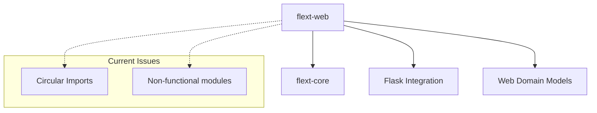

# flext-web

**Web application framework for the FLEXT ecosystem** providing core web interface patterns using **Clean Architecture** with **Flask integration**.

> **⚠️ STATUS**: Development phase - circular import issues prevent current functionality, requires architectural fixes before feature development

**Version**: 0.9.0 | **Dependencies**: flext-core

## 🎯 Purpose and Role in FLEXT Ecosystem

### **For the FLEXT Ecosystem**

Provides web application infrastructure patterns for FLEXT projects requiring web interfaces, implementing Clean Architecture with Domain-Driven Design through flext-core integration.

### **Key Responsibilities**

1. **Web Interface Patterns** - Standardized web application architecture for FLEXT projects
2. **Flask Integration** - Web framework abstraction using established patterns
3. **Domain Modeling** - Web application entities with business logic validation

### **Integration Points**

- **flext-core** → Foundation patterns (FlextResult, FlextModels, domain services)
- **Other FLEXT Projects** → Web interface implementation when required

---

## 🚨 Current Development Status

**Critical Issues**:
- **Circular Import Error**: `config.py` ↔ `settings.py` prevents module loading
- **Non-Functional Code**: Cannot import any classes from the library
- **Architecture Needs**: Module structure requires refactoring

**Working Components**:
- Source code structure (15 Python files, 4,442 lines)
- Documentation framework
- Clean Architecture patterns in design

## 🏗️ Architecture and Patterns

### **FLEXT-Core Integration Status**

| Pattern             | Status | Description                    |
| ------------------- | ------ | ------------------------------ |
| **FlextResult<T>**  | 🟡 40% | Used in models, needs handlers |
| **FlextService**    | 🔴 0%  | Not implemented yet            |
| **FlextContainer**  | 🔴 0%  | No dependency injection        |
| **Domain Patterns** | 🟡 30% | Basic entities, needs services |

> **Status**: 🔴 Critical Issues | 🟡 Partial Implementation | 🟢 Complete

### **Architecture Overview**



---

## 🚀 Installation and Setup

**Requirements**:
- Python 3.11+
- Poetry for dependency management
- flext-core (ecosystem dependency)

**Current Status**: Installation possible but imports fail due to circular dependencies

---

## 🔧 Development Commands

### Essential Commands

```bash
# Quality gates (some blocked by import issues)
make validate       # Full validation
make lint          # Code linting (works)
make type-check    # Type checking (works)
make format        # Code formatting
make test          # Testing (blocked by imports)

# Development
make setup         # Development setup
```

### Quality Gates Status

- **Linting**: ✅ Works on source files
- **Type Checking**: ✅ Works on source files
- **Testing**: ❌ Blocked by import failures
- **Integration**: ❌ Blocked by import failures

---

## 🧪 Testing

### Current Testing Status

**Blocked**: Cannot run tests due to circular import issues

```bash
# This currently fails:
make test
# Tests cannot import modules being tested
```

### Test Structure (Intended)

```
tests/
├── unit/              # Unit tests for modules
├── integration/       # Integration with flext-core
└── conftest.py        # Test configuration
```

**Testing Commands** (once functional):
```bash
make test-unit         # Unit tests only
make test-integration  # Integration tests
make coverage          # Coverage reporting
```

---

## 📊 Status and Metrics

### Current Development Status

**Version**: 0.9.0
**Development Phase**: Architectural fixes required

### Quality Standards

- **Coverage**: Cannot measure (testing blocked)
- **Type Safety**: Source files pass type checking
- **Security**: Not assessed until functional
- **FLEXT-Core Compliance**: 20% (partial, cannot verify full integration)

### Critical Issues

1. **Circular Import Error**: `config.py` ↔ `settings.py`
2. **Non-Functional State**: Cannot import any classes
3. **Testing Blocked**: Cannot verify functionality

---

## 🗺️ Development Roadmap

### **Current Priority (Critical)**

**Fix Circular Dependencies**:
- Resolve `config.py` ↔ `settings.py` import loop
- Refactor module structure for proper separation
- Verify basic imports work

### **Next Phase**

**Establish Basic Functionality**:
- Test core classes load correctly
- Implement proper FLEXT-core integration
- Restore testing capability

### **Future Development**

**Feature Implementation**:
- Web application patterns
- Flask integration improvements
- Enhanced domain modeling

---

## 📚 Documentation

```
┌─────────────────────────────────────────────────────────────────┐
│                    FLEXT ECOSYSTEM (32 Projects)                 │
├─────────────────────────────────────────────────────────────────┤
│ Services: FlexCore(Go) | FLEXT Service(Go/Python) | Clients     │
├─────────────────────────────────────────────────────────────────┤
│ Applications: API | Auth | [FLEXT-WEB] | CLI | Quality | Observ │
├═════════════════════════════════════════════════════════════════┤
│ Infrastructure: Oracle | LDAP | LDIF | gRPC | Plugin | WMS      │
├─────────────────────────────────────────────────────────────────┤
│ Singer Ecosystem: Taps(5) | Targets(5) | DBT(4) | Extensions(1) │
├─────────────────────────────────────────────────────────────────┤
│ Foundation: FLEXT-CORE (FlextResult | DI | Domain Patterns)     │
└─────────────────────────────────────────────────────────────────┘
```

### **Core Responsibilities (2025 Web Framework)**

1. **Modern Web Framework**: FastAPI/Flask abstraction with async-first development
2. **Enterprise Authentication**: OAuth 2.1 integration through flext-auth
3. **Real-time Communication**: WebSocket support with authentication
4. **Advanced CLI Tooling**: Project scaffolding, hot reload, deployment automation
5. **Performance Optimization**: Edge caching, connection pooling, async processing
6. **Ecosystem Integration**: Unified interface for all FLEXT Python web projects

## Key Features (2025 Web Framework)

### **Current Capabilities (Foundation)**

- **FlextWebService**: Flask-based web service with Clean Architecture
- **Domain Models**: Proper entity modeling with business rule validation
- **CQRS Handlers**: Command/Query separation with FlextResult patterns
- **Configuration System**: Environment-aware settings with validation

### **Modern Features (2025 Transformation)**

- **Async Web Framework**: FastAPI backend option with ASGI support
- **WebSocket Communication**: Real-time messaging with authentication
- **Advanced CLI**: `flext web` commands for project management
- **Edge Caching**: Multi-tier Redis caching with performance monitoring
- **OAuth 2.1 Authentication**: Enterprise security through flext-auth
- **Auto-Documentation**: OpenAPI 3.1 spec generation with interactive docs

### **API Endpoints (Current + Modern)**

```bash
# Current Flask endpoints
GET /health                     # Service health check
GET /                          # Web dashboard
GET /api/v1/apps               # List applications
POST /api/v1/apps              # Create application
GET /api/v1/apps/<id>          # Get application details
POST /api/v1/apps/<id>/start   # Start application
POST /api/v1/apps/<id>/stop    # Stop application

# Modern async endpoints (2025 transformation)
WebSocket /ws/{client_id}       # Real-time communication
GET /api/v2/apps (async)        # Async application listing
POST /api/v2/apps (async)       # Async application creation
GET /docs                       # Auto-generated API documentation
GET /redoc                      # ReDoc API documentation
GET /metrics                    # Prometheus metrics endpoint
```

## Installation & Usage (Modern Web Framework)

### Installation

```bash
# Clone and install modern web framework
cd /path/to/flext-web
poetry install

# Modern development setup with optional FastAPI backend
make setup
flext web check-dependencies --backend=fastapi
```

### Basic Usage (Framework Library)

```python
from flext_web import FlextWebApp, FlextAsyncWebService
from flext_web.async_web import create_fastapi_service

# Modern async web service (FastAPI backend)
async def create_modern_app():
    service = await create_fastapi_service()
    app = await service.create_web_application({
        "name": "modern-app",
        "backend": "fastapi",
        "host": "0.0.0.0",
        "port": 8080
    })
    return app.unwrap()

# Traditional Flask service (compatibility)
from flext_web import create_service, get_web_settings
service = create_service()
service.run()
```

### Modern CLI Usage (2025 Standards)

```bash
# Project scaffolding
flext web create-project myapp --template=fastapi-async
flext web create-project legacy --template=flask-sync

# Modern development server
flext web dev --backend=fastapi --hot-reload --port=8080 --workers=4
flext web start-server --environment=production --asgi-server=uvicorn

# Advanced operations
flext web generate routes --from-openapi=spec.json --async-handlers
flext web test-api --endpoint=all --include-websocket
flext web deploy --environment=production --container=docker
```

## Development Commands

### Quality Gates (Zero Tolerance)

```bash
# Complete validation pipeline (run before commits)
make validate              # Full validation (lint + type + security + test)
make check                 # Quick lint + type check + test
make test                  # Run all tests (90% coverage requirement)
make lint                  # Code linting
make type-check
make format                # Code formatting
make security              # Security scanning
```

### Web Development

```bash
# Server operations
make runserver             # Start Flask development server (localhost:8080)
make dev-server            # Start with hot reload
make web-test              # Test web service creation
```

### Testing

```bash
# Test categories
make test-unit             # Unit tests only
make test-integration      # Integration tests only
make test-api              # API endpoint tests
make test-web              # Web interface tests
make coverage-html         # Generate HTML coverage report
```

## Configuration

### Environment Variables

```bash
# Web service configuration
export FLEXT_WEB_HOST="localhost"
export FLEXT_WEB_PORT="8080"
export FLEXT_WEB_DEBUG="true"
export FLEXT_WEB_SECRET_KEY="your-secret-key"
```

## Quality Standards

### **Quality Targets (2025 Standards)**

- **Coverage**: 95% target with async test patterns
- **Type Safety**: MyPy strict mode + PyRight with Pydantic v2
- **Linting**: Ruff comprehensive rules + security patterns
- **Security**: Bandit + pip-audit + OAuth 2.1 compliance
- **Performance**: Sub-100ms response times with edge caching
- **Modern Architecture**: FastAPI-grade async patterns

## Integration with FLEXT Ecosystem

### **FLEXT Core Patterns**

```python
# FlextResult for all operations
from flext_web import FlextWebService

service = FlextWebService()
result = service.create_app("test-app", 3000, "localhost")
if result.success:
    app = result.data
    print(f"Created app: {app.name}")
else:
    print(f"Error: {result.error}")
```

### **Service Integration (2025 Ecosystem)**

- **flext-auth**: OAuth 2.1 authentication with WebSocket token support
- **flext-observability**: Prometheus metrics, distributed tracing, structured logging
- **flext-api**: HTTP client integration with FastAPI backend compatibility
- **flext-cli**: Advanced web CLI with project scaffolding and deployment
- **FlexCore (Go)**: Runtime service integration with async communication
- **FLEXT Service**: Data platform coordination with connection pooling

## Current Status (2025 Transformation)

**Version**: 0.9.0 → 2.0.0 (Advanced Web Framework Transformation)

**Foundation Completed (4,442 lines Python)**:

- ✅ Flask web service with Clean Architecture (services.py - 818 lines)
- ✅ Domain models with business rules (models.py - 280 lines)
- ✅ CQRS pattern implementation (handlers.py - 692 lines)
- ✅ Comprehensive configuration system (config.py - 776 lines)
- ✅ Complete documentation structure (8 comprehensive docs)

**2025 Transformation In Progress**:

- 🚀 **FastAPI Integration**: Async web framework backend option
- 🔐 **OAuth 2.1 Authentication**: Enterprise security through flext-auth
- 🌐 **WebSocket Support**: Real-time communication with authentication
- ⚡ **Edge Caching**: Multi-tier Redis caching system
- 🛠️ **Advanced CLI**: Project scaffolding and deployment automation

**Next Phase (2025 Standards)**:

- 📊 **Monitoring Integration**: Prometheus metrics and distributed tracing
- 🔧 **Developer Experience**: Auto-documentation, hot reload, testing tools
- 🏗️ **Production Features**: Container deployment, load balancing, scaling

## Contributing

### Development Standards (2025 Requirements)

- **Modern Architecture**: FastAPI-grade async patterns with FLEXT integration
- **Type Safety**: MyPy strict mode + PyRight with Pydantic v2 models
- **Testing**: Maintain 95% coverage with async test patterns
- **Code Quality**: Ruff comprehensive rules + security compliance
- **Performance**: Sub-100ms response times with edge caching
- **Security**: OAuth 2.1 compliance with automatic security headers

### Development Workflow (Modern)

```bash
# Modern setup and validation
make setup
flext web check-dependencies --backend=fastapi
make validate  # Comprehensive quality gates
make test      # 95% coverage with async patterns

# Modern development server
flext web dev --backend=fastapi --hot-reload --port=8080
# or: make runserver (traditional Flask mode)

# Quality assurance
make type-check  # MyPy strict + PyRight
make security    # OAuth 2.1 compliance check
```

## License

MIT License - See [LICENSE](LICENSE) file for details.

## Links & Documentation

- **[TODO.md](TODO.md)**: Complete transformation roadmap (2025 standards)
- **[flext-core](../flext-core)**: Foundation library and patterns
- **[CLAUDE.md](CLAUDE.md)**: Development standards and quality guidelines
- **[Documentation](docs/)**: Architecture guides and development patterns
- **[Architecture Guide](docs/architecture/README.md)**: Clean Architecture + DDD implementation
- **[API Reference](docs/api/README.md)**: Complete REST API documentation

---

**FLEXT-Web 2025**: Transforming from Flask service to FastAPI-grade async web framework with enterprise features, WebSocket support, OAuth 2.1 authentication, and comprehensive CLI tooling for the FLEXT ecosystem.
