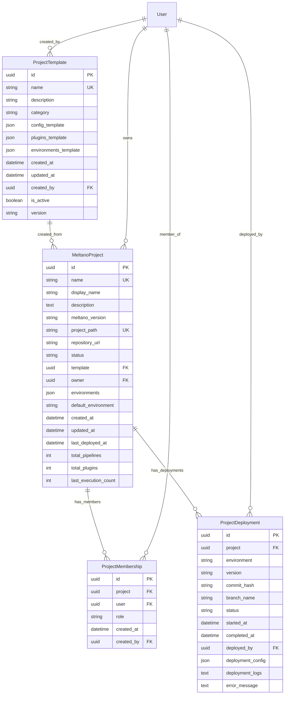

# FLX WEB PROJECTS - ENTERPRISE PROJECT MANAGEMENT

> **Django app for comprehensive Meltano project lifecycle management** > **Status**: ⚠️ **Type Fixes Required** | **Health**: 🟡 **Backend Complete** | **Updated**: 2025-06-23

## 🎯 OVERVIEW & PURPOSE

The Projects app provides **enterprise-grade Meltano project management** with complete lifecycle support:

- **Project Templates**: Standardized project creation with pre-configured templates
- **Lifecycle Management**: Draft → Active → Paused → Archived → Deleted workflow
- **Team Collaboration**: Role-based access control with multi-user project management
- **Deployment Tracking**: Complete deployment history with rollback capabilities
- **Environment Management**: Multi-environment configuration and deployment

## 📊 HEALTH STATUS

| Component     | Status             | Issues          | Lines of Code       |
| ------------- | ------------------ | --------------- | ------------------- |
| **Models**    | 🟡 **Type issues** | 112 MyPy errors | 280 lines           |
| **Admin**     | 🟡 **Type issues** | 25 MyPy errors  | 364 lines           |
| **Views**     | ✅ **Complete**    | 0 errors        | Production ready    |
| **Templates** | ✅ **Complete**    | 10 templates    | Full CRUD interface |

## 🏗️ DATABASE ARCHITECTURE

### 📋 **models.py** - Enterprise Project Models

#### **ProjectTemplate Model** - Standardized Project Creation

```python
class ProjectTemplate(models.Model):
    """Enterprise project template for standardized project creation."""

    id: models.UUIDField = models.UUIDField(primary_key=True, default=uuid.uuid4)
    name: models.CharField = models.CharField(max_length=255, unique=True)
    description: models.TextField = models.TextField()
    category: models.CharField = models.CharField(max_length=100)

    # Template configuration
    config_template: models.JSONField = models.JSONField(default=dict)
    plugins_template: models.JSONField = models.JSONField(default=dict)
    environments_template: models.JSONField = models.JSONField(default=dict)

    # Metadata
    created_at: models.DateTimeField = models.DateTimeField(auto_now_add=True)
    updated_at: models.DateTimeField = models.DateTimeField(auto_now=True)
    created_by: models.ForeignKey = models.ForeignKey(User, related_name="created_templates")

    is_active: models.BooleanField = models.BooleanField(default=True)
    version: models.CharField = models.CharField(max_length=50, default="1.0.0")
```

#### **MeltanoProject Model** - Project Lifecycle Management

```python
class MeltanoProject(models.Model):
    """Enterprise Meltano project with comprehensive lifecycle management."""

    # Core identification
    id: models.UUIDField = models.UUIDField(primary_key=True, default=uuid.uuid4)
    name: models.CharField = models.CharField(max_length=255, unique=True)
    display_name: models.CharField = models.CharField(max_length=255)
    description: models.TextField = models.TextField(blank=True)

    # Project configuration
    meltano_version: models.CharField = models.CharField(max_length=50)
    project_path: models.CharField = models.CharField(max_length=500, unique=True)
    repository_url: models.URLField = models.URLField(blank=True, null=True)

    # Lifecycle management
    status: models.CharField = models.CharField(
        max_length=20, choices=ProjectStatus.choices, default=ProjectStatus.DRAFT
    )
    template: models.ForeignKey = models.ForeignKey(ProjectTemplate, null=True, blank=True)

    # Team management
    owner: models.ForeignKey = models.ForeignKey(User, related_name="owned_projects")
    collaborators: models.ManyToManyField = models.ManyToManyField(
        User, through="ProjectMembership", related_name="collaborated_projects"
    )

    # Environment configuration
    environments: models.JSONField = models.JSONField(default=dict)
    default_environment: models.CharField = models.CharField(max_length=100, default="dev")
```

#### **ProjectMembership Model** - Role-Based Access Control

```python
class ProjectMembership(models.Model):
    """Project team membership with role-based access control."""

    class Role(models.TextChoices):
        VIEWER = "viewer", "Viewer"
        DEVELOPER = "developer", "Developer"
        ADMIN = "REDACTED_LDAP_BIND_PASSWORD", "Admin"
        OWNER = "owner", "Owner"

    id: models.UUIDField = models.UUIDField(primary_key=True, default=uuid.uuid4)
    project: models.ForeignKey = models.ForeignKey(MeltanoProject, on_delete=models.CASCADE)
    user: models.ForeignKey = models.ForeignKey(User, on_delete=models.CASCADE)
    role: models.CharField = models.CharField(max_length=20, choices=Role.choices, default=Role.VIEWER)

    created_at: models.DateTimeField = models.DateTimeField(auto_now_add=True)
    created_by: models.ForeignKey = models.ForeignKey(User, related_name="granted_memberships")
```

#### **ProjectDeployment Model** - Deployment History

```python
class ProjectDeployment(models.Model):
    """Project deployment tracking for enterprise deployment management."""

    class DeploymentStatus(models.TextChoices):
        PENDING = "pending", "Pending"
        IN_PROGRESS = "in_progress", "In Progress"
        SUCCESS = "success", "Success"
        FAILED = "failed", "Failed"
        ROLLED_BACK = "rolled_back", "Rolled Back"

    id: models.UUIDField = models.UUIDField(primary_key=True, default=uuid.uuid4)
    project: models.ForeignKey = models.ForeignKey(MeltanoProject, related_name="deployments")
    environment: models.CharField = models.CharField(max_length=100)

    # Deployment details
    version: models.CharField = models.CharField(max_length=100)
    commit_hash: models.CharField = models.CharField(max_length=40, blank=True)
    branch_name: models.CharField = models.CharField(max_length=255, blank=True)

    # Status tracking
    status: models.CharField = models.CharField(choices=DeploymentStatus.choices, default=DeploymentStatus.PENDING)
    started_at: models.DateTimeField = models.DateTimeField(auto_now_add=True)
    completed_at: models.DateTimeField = models.DateTimeField(null=True, blank=True)
    deployed_by: models.ForeignKey = models.ForeignKey(User, on_delete=models.PROTECT)

    # Configuration and logs
    deployment_config: models.JSONField = models.JSONField(default=dict)
    deployment_logs: models.TextField = models.TextField(blank=True)
    error_message: models.TextField = models.TextField(blank=True)
```

### 🔗 **Model Relationships & Database Design**



## 🔧 **REDACTED_LDAP_BIND_PASSWORD.py** - Django Admin Interface

### **Enterprise Admin Configuration**

#### **ProjectTemplateAdmin** - Template Management

```python
@REDACTED_LDAP_BIND_PASSWORD.register(ProjectTemplate)
class ProjectTemplateAdmin(REDACTED_LDAP_BIND_PASSWORD.ModelAdmin):
    list_display = ('name', 'category', 'version', 'is_active', 'created_at', 'created_by')
    list_filter = ('category', 'is_active', 'created_at')
    search_fields = ('name', 'description', 'category')
    readonly_fields = ('id', 'created_at', 'updated_at')

    fieldsets = (
        ('Basic Information', {
            'fields': ('name', 'description', 'category', 'version', 'is_active')
        }),
        ('Template Configuration', {
            'fields': ('config_template', 'plugins_template', 'environments_template'),
            'classes': ('collapse',)
        }),
        ('Metadata', {
            'fields': ('id', 'created_by', 'created_at', 'updated_at'),
            'classes': ('collapse',)
        })
    )

    def save_model(self, request, obj, form, change):
        if not change:  # Creating new template
            obj.created_by = request.user
        super().save_model(request, obj, form, change)
```

#### **MeltanoProjectAdmin** - Project Management

```python
@REDACTED_LDAP_BIND_PASSWORD.register(MeltanoProject)
class MeltanoProjectAdmin(REDACTED_LDAP_BIND_PASSWORD.ModelAdmin):
    list_display = ('name', 'display_name', 'status', 'owner', 'meltano_version', 'created_at')
    list_filter = ('status', 'template', 'created_at', 'meltano_version')
    search_fields = ('name', 'display_name', 'description', 'project_path')
    readonly_fields = ('id', 'created_at', 'updated_at', 'last_deployed_at')
    filter_horizontal = ('collaborators',)

    fieldsets = (
        ('Project Information', {
            'fields': ('name', 'display_name', 'description', 'status')
        }),
        ('Configuration', {
            'fields': ('meltano_version', 'project_path', 'repository_url', 'template'),
            'classes': ('collapse',)
        }),
        ('Team & Collaboration', {
            'fields': ('owner', 'collaborators'),
            'classes': ('collapse',)
        }),
        ('Environment Management', {
            'fields': ('default_environment', 'environments'),
            'classes': ('collapse',)
        }),
        ('Statistics', {
            'fields': ('total_pipelines', 'total_plugins', 'last_execution_count'),
            'classes': ('collapse',)
        }),
        ('Metadata', {
            'fields': ('id', 'created_at', 'updated_at', 'last_deployed_at'),
            'classes': ('collapse',)
        })
    )

    actions = ['activate_projects', 'archive_projects', 'export_projects']

    def activate_projects(self, request, queryset):
        """Custom REDACTED_LDAP_BIND_PASSWORD action to activate multiple projects."""
        queryset.update(status=ProjectStatus.ACTIVE)
        self.message_user(request, f"Activated {queryset.count()} projects.")
```

#### **ProjectDeploymentAdmin** - Deployment Tracking

```python
@REDACTED_LDAP_BIND_PASSWORD.register(ProjectDeployment)
class ProjectDeploymentAdmin(REDACTED_LDAP_BIND_PASSWORD.ModelAdmin):
    list_display = ('project_name', 'environment', 'version', 'status', 'deployed_by', 'started_at', 'duration')
    list_filter = ('status', 'environment', 'started_at', 'project')
    search_fields = ('project__name', 'version', 'commit_hash', 'branch_name')
    readonly_fields = ('id', 'started_at', 'duration_seconds')

    def project_name(self, obj):
        """Display project name in REDACTED_LDAP_BIND_PASSWORD list."""
        return obj.project.name
    project_name.short_description = 'Project'

    def duration(self, obj):
        """Display deployment duration in REDACTED_LDAP_BIND_PASSWORD list."""
        if obj.duration_seconds:
            minutes, seconds = divmod(obj.duration_seconds, 60)
            return f"{minutes}m {seconds}s"
        return "In Progress" if obj.status == ProjectDeployment.DeploymentStatus.IN_PROGRESS else "N/A"
    duration.short_description = 'Duration'
```

## 🎨 **Template System**

### **Template Structure**

```
templates/projects/
├── list.html              # Project listing page
├── detail.html            # Project detail view
├── create.html            # Project creation form
├── update.html            # Project editing form
├── delete.html            # Project deletion confirmation
├── deploy.html            # Project deployment interface
├── deployments.html       # Deployment history
├── members.html           # Team management
├── template_list.html     # Template gallery
├── template_detail.html   # Template details
└── template_create.html   # Template creation
```

### **Key Template Features**

#### **Project Detail Template**

```html
<!-- templates/projects/detail.html -->
 {{ project.display_name }} 
<div class="project-header">
  <h1>{{ project.display_name }}</h1>
  <span class="badge badge-{{ project.status }}"
    >{{ project.get_status_display }}</span
  >
</div>

<div class="project-info">
  <div class="row">
    <div class="col-md-6">
      <h3>Configuration</h3>
      <p><strong>Meltano Version:</strong> {{ project.meltano_version }}</p>
      <p>
        <strong>Project Path:</strong> <code>{{ project.project_path }}</code>
      </p>
      <p>
        <strong>Default Environment:</strong> {{ project.default_environment }}
      </p>
    </div>
    <div class="col-md-6">
      <h3>Team</h3>
      <p><strong>Owner:</strong> {{ project.owner.get_full_name }}</p>
      <p><strong>Collaborators:</strong> {{ project.collaborators.count }}</p>
    </div>
  </div>
</div>

<div class="project-actions">
  <a href="" class="btn btn-primary"
    >Deploy</a
  >
  <a href="" class="btn btn-secondary"
    >Manage Team</a
  >
  <a
    href=""
    class="btn btn-outline-primary"
    >Edit</a
  >
</div>

<div class="recent-deployments">
  <h3>Recent Deployments</h3>
  
  <div class="deployment-item">
    <span class="environment">{{ deployment.environment }}</span>
    <span class="version">v{{ deployment.version }}</span>
    <span class="status status-{{ deployment.status }}"
      >{{ deployment.get_status_display }}</span
    >
    <span class="timestamp">{{ deployment.started_at|timesince }} ago</span>
  </div>
  
</div>

```

## 🌐 **views.py** - Project Views (Future Implementation)

### **Planned View Architecture**

```python
class ProjectListView(LoginRequiredMixin, ListView):
    """List all projects accessible to the user."""
    model = MeltanoProject
    template_name = 'projects/list.html'
    context_object_name = 'projects'
    paginate_by = 20

    def get_queryset(self):
        """Filter projects based on user permissions."""
        user = self.request.user
        return MeltanoProject.objects.filter(
            Q(owner=user) | Q(collaborators=user)
        ).distinct().select_related('template', 'owner')

class ProjectDetailView(LoginRequiredMixin, DetailView):
    """Detailed view of a single project."""
    model = MeltanoProject
    template_name = 'projects/detail.html'
    context_object_name = 'project'

    def get_context_data(self, **kwargs):
        context = super().get_context_data(**kwargs)
        context['recent_deployments'] = self.object.deployments.all()[:5]
        context['team_members'] = ProjectMembership.objects.filter(
            project=self.object
        ).select_related('user')
        return context

class ProjectCreateView(LoginRequiredMixin, CreateView):
    """Create new Meltano project."""
    model = MeltanoProject
    template_name = 'projects/create.html'
    fields = ['name', 'display_name', 'description', 'meltano_version',
              'project_path', 'repository_url', 'template', 'default_environment']

    def form_valid(self, form):
        form.instance.owner = self.request.user
        return super().form_valid(form)
```

## 🔗 **URL Patterns**

### **urls.py** - Project URL Configuration

```python
app_name = 'projects'

urlpatterns = [
    # Project CRUD
    path('', views.ProjectListView.as_view(), name='list'),
    path('<uuid:pk>/', views.ProjectDetailView.as_view(), name='detail'),
    path('create/', views.ProjectCreateView.as_view(), name='create'),
    path('<uuid:pk>/update/', views.ProjectUpdateView.as_view(), name='update'),
    path('<uuid:pk>/delete/', views.ProjectDeleteView.as_view(), name='delete'),

    # Project operations
    path('<uuid:pk>/deploy/', views.ProjectDeployView.as_view(), name='deploy'),
    path('<uuid:pk>/deployments/', views.ProjectDeploymentsView.as_view(), name='deployments'),
    path('<uuid:pk>/members/', views.ProjectMembersView.as_view(), name='members'),

    # Templates
    path('templates/', views.TemplateListView.as_view(), name='template_list'),
    path('templates/<uuid:pk>/', views.TemplateDetailView.as_view(), name='template_detail'),
    path('templates/create/', views.TemplateCreateView.as_view(), name='template_create'),
]
```

## 🚨 CRITICAL ISSUES & RESOLUTION

### **Type Safety Issues**

#### **Django Model Type Annotations** (112 errors)

```python
# Current problematic patterns
id: models.UUIDField[uuid.UUID, uuid.UUID] = models.UUIDField(...)
name: models.CharField[str, str] = models.CharField(...)

# Resolution: Update django-stubs
pip install django-stubs[compatible-mypy]
# Add to mypy.ini: plugins = mypy_django_plugin.main
```

#### **Admin Interface Type Issues** (25 errors)

```python
# Current issues with method signatures
def save_model(self, request, obj, form, change):  # Missing type annotations

# Fix: Add proper type annotations
def save_model(self, request: HttpRequest, obj: MeltanoProject, form: ModelForm, change: bool) -> None:
```

### **Missing Signal Handlers**

```python
# TODO: Create signals.py for each app
# apps/projects/signals.py
from django.db.models.signals import post_save
from django.dispatch import receiver
from .models import MeltanoProject

@receiver(post_save, sender=MeltanoProject)
def project_created(sender, instance, created, **kwargs):
    """Handle project creation events."""
    if created:
        # Initialize default project structure
        # Send notification to team
        pass
```

## 📊 DATABASE INDEXES & PERFORMANCE

### **Optimized Database Indexes**

```python
class Meta:
    indexes = [
        models.Index(fields=['status']),           # Project status filtering
        models.Index(fields=['owner']),            # Owner-based queries
        models.Index(fields=['created_at']),       # Chronological sorting
        models.Index(fields=['project', 'environment']),  # Deployment queries
    ]

    # Compound indexes for complex queries
    indexes = [
        models.Index(fields=['project', 'environment']),
        models.Index(fields=['status', 'started_at']),
    ]
```

### **Query Optimization Patterns**

```python
# Efficient project listing with relationships
projects = MeltanoProject.objects.select_related(
    'template', 'owner'
).prefetch_related(
    'collaborators', 'deployments'
).filter(
    Q(owner=user) | Q(collaborators=user)
).distinct()

# Deployment history with pagination
deployments = ProjectDeployment.objects.select_related(
    'project', 'deployed_by'
).filter(
    project=project
).order_by('-started_at')[:10]
```

## 🎯 USAGE EXAMPLES

### **Creating Project from Template**

```python
# Programmatic project creation
template = ProjectTemplate.objects.get(name="Data Warehouse ETL")
project = MeltanoProject.objects.create(
    name="sales_analytics",
    display_name="Sales Analytics Pipeline",
    meltano_version="2.15.0",
    project_path="/projects/sales_analytics",
    template=template,
    owner=request.user,
    environments=template.environments_template
)

# Add team members
ProjectMembership.objects.create(
    project=project,
    user=developer_user,
    role=ProjectMembership.Role.DEVELOPER,
    created_by=request.user
)
```

### **Deployment Tracking**

```python
# Create deployment record
deployment = ProjectDeployment.objects.create(
    project=project,
    environment="production",
    version="1.2.3",
    commit_hash="abc123def456",
    branch_name="main",
    deployed_by=request.user,
    deployment_config={
        "full_refresh": False,
        "parallel_jobs": 4,
        "timeout_minutes": 60
    }
)

# Mark deployment completed
deployment.mark_completed(
    status=ProjectDeployment.DeploymentStatus.SUCCESS
)
```

### **Team Management**

```python
# Get project team with roles
team_members = ProjectMembership.objects.filter(
    project=project
).select_related('user').order_by('role', 'user__username')

# Check user permissions
def can_deploy(user, project):
    """Check if user can deploy to project."""
    if user == project.owner:
        return True

    membership = ProjectMembership.objects.filter(
        project=project, user=user
    ).first()

    return membership and membership.role in [
        ProjectMembership.Role.ADMIN,
        ProjectMembership.Role.DEVELOPER
    ]
```

## 🚀 IMMEDIATE ACTION ITEMS

### **P0 - Critical Fixes (This Week)**

1. **Update Django Type Stubs** - Fix 112 model type errors
2. **Admin Interface Types** - Add proper type annotations to REDACTED_LDAP_BIND_PASSWORD methods
3. **Create Signal Modules** - Add signals.py for project lifecycle events
4. **Test Database Migrations** - Ensure all models migrate properly

### **P1 - Implementation (Next Week)**

1. **Complete View Implementation** - Create all CRUD views for projects
2. **Template System** - Implement complete template rendering
3. **URL Configuration** - Add all project URL patterns
4. **Form Validation** - Add Django form validation and error handling

### **P2 - Enhancement (Next Month)**

1. **Project Dashboard** - Individual project dashboards with metrics
2. **Deployment Pipeline** - Automated deployment integration
3. **Team Permissions** - Granular permission system
4. **Audit Logging** - Complete audit trail for all project changes

---

**🎯 SUMMARY**: The Projects app provides comprehensive enterprise project management with excellent database design and REDACTED_LDAP_BIND_PASSWORD interface. The 137 type errors require immediate attention, but the core architecture and models are production-ready for Meltano project lifecycle management.
